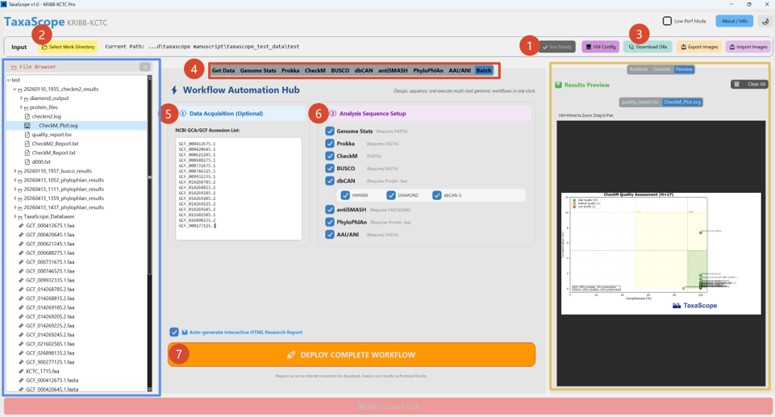

# TaxaScope User Manual

TaxaScope is an integrated graphical user interface (GUI) toolkit for microbial genome analysis on Windows. It provides a guided environment for configuring, executing, inspecting, and documenting genome-based taxonomic workflows.

## Overview

TaxaScope is designed to reduce the manual burden of command-line bioinformatics workflows while preserving reproducibility. The software integrates containerized execution, working-directory-based data management, database tracking, batch workflow configuration, and result inspection in a single desktop interface.

The main workflow supports:

- genome assembly statistics
- genome annotation
- genome quality assessment
- completeness assessment
- CAZyme annotation
- biosynthetic gene cluster detection
- ANI/AAI comparison
- whole-genome phylogeny
- structured run reporting

## Graphical User Interface



**Figure 2. Graphical user interface (GUI) of TaxaScope and workflow configuration.** The TaxaScope graphical user interface provides an integrated environment for configuring and executing genome-based taxonomic workflows. The interface is organized into functional panels guiding users from environment initialization to workflow execution and result inspection.

Numbered elements indicate key steps in the workflow:

1. **Environment setup.** Initialization of the required execution environment, including WSL2 and the container engine (Podman/Docker), performed only once during installation and not required for subsequent analyses.
2. **Working directory selection.** Users specify a project directory for input data, intermediate files, and outputs.
3. **Database download.** Required reference databases are downloaded to the working directory, need to be installed only once, and can be reused by relocating them to other working directories.
4. **Parameter configuration.** Individual analysis modules, such as Prokka, CheckM, and BUSCO, allow parameter adjustment prior to execution, defining tool-specific settings.
5. **Data acquisition (optional).** Genome assemblies can be retrieved from NCBI using accession numbers, such as GCF or GCA accessions. Alternatively, users can provide local sequence files, including genome assemblies or protein sequences in FASTA/FA format, placed within the working directory.
6. **Workflow selection (batch mode).** Users select and combine analysis modules into a sequential workflow.
7. **Workflow execution.** The pipeline is initiated through a single command.

The left panel, highlighted in blue, displays the file browser, showing all input files, intermediate results, and outputs generated within the working directory. The central panel presents workflow configuration and module selection. The right panel, highlighted in yellow, contains three tabs: Runtime, showing task status and progress; Console, providing command-line logs for transparency and troubleshooting; and Preview, enabling visualization of selected results from the file browser, including figures and report outputs.

## System Requirements

Recommended environment:

- Windows 10 or Windows 11
- WSL2
- Podman or Docker Desktop configured for Linux containers
- At least 16 GB RAM for small bacterial genome batches
- 32 GB RAM or higher for CheckM2, antiSMASH, and larger batch workflows
- Sufficient disk space for databases, containers, and intermediate outputs

TaxaScope primarily uses Podman on Windows, while the main analysis modules include Docker fallback support when Docker Desktop is installed and running.

## Working Directory

TaxaScope uses one selected folder as the working directory. This directory stores input data, intermediate files, outputs, local databases, and run reports.

Example layout:

```text
project_folder/
├── genome_1.fasta
├── genome_2.fasta
├── metadata.json
├── TaxaScope_Databases/
├── genome_stats.xlsx
├── *_Prokka_Results/
├── *_checkm2_results/
├── *_busco_results/
├── *_ANI-AAI/
├── *_phylophlan_results/
├── TaxaScope_Run_Manifest.json
├── TaxaScope_Run_Report.md
└── TaxaScope_Report.html
```

## Input Formats

Supported input formats depend on the selected module.

| Module | Input format | Purpose |
| --- | --- | --- |
| Get Data | GCA/GCF accessions | NCBI genome acquisition |
| Genome Stats | `.fasta`, `.fa`, `.fna` | Assembly statistics |
| Prokka | `.fasta`, `.fa`, `.fna` | Genome annotation |
| CheckM | `.fasta`, `.fa`, `.fna` | Genome quality assessment |
| BUSCO | `.fasta`, `.fa`, `.fna` | Genome completeness assessment |
| dbCAN | `.faa` | CAZyme annotation |
| antiSMASH | `.fasta`, `.fa`, `.fna`, `.gbk`, `.gbff` | Biosynthetic gene cluster detection |
| PhyloPhlAn | `.faa` | Whole-genome phylogeny |
| AAI/ANI | `.fasta`, `.fa`, `.fna` | Pairwise genome similarity |

## Database Setup

Reference databases are stored under the selected working directory:

```text
<working directory>/TaxaScope_Databases
```

The database folder includes a structured source manifest:

```text
TaxaScope_Databases/database_sources.json
```

TaxaScope uses this file to report database names, versions, download sources, and notes in the reproducibility outputs.

## Complete Analysis Case

This example describes a typical bacterial genome workflow.

### 1. Prepare Data

Create a project folder and place genome FASTA files in it, or use the Get Data panel to download genomes from NCBI accessions.

### 2. Select Working Directory

Use the working directory selector to choose the project folder. TaxaScope will use this location for input files, intermediate files, final outputs, databases, and reports.

### 3. Download Databases

Click Download DBs to install the required reference databases. This step is required only once for a working directory. The database folder can also be copied to another project directory for reuse.

### 4. Configure Modules

Open each analysis module tab and adjust parameters when needed. Batch mode can combine multiple modules into a sequential workflow.

### 5. Run the Workflow

Select the desired modules and click Deploy Complete Workflow. TaxaScope will run the selected tools sequentially and write outputs into the working directory.

### 6. Inspect Results

Use the file browser to select output tables, figures, reports, or tree files. The Preview panel displays compatible result files directly in the GUI.

## Typical Batch Workflow

A standard taxonomic workflow can include:

1. Genome Stats
2. Prokka
3. CheckM
4. BUSCO
5. dbCAN
6. antiSMASH
7. PhyloPhlAn
8. AAI/ANI

Users can enable or disable modules depending on the scientific question and available input formats.

## Reproducibility Reports

TaxaScope exports structured reports for each run.

### `TaxaScope_Run_Manifest.json`

Machine-readable manifest containing:

- TaxaScope version
- working directory
- database root
- software environment
- tool names
- software versions
- container images
- database versions
- run parameters
- timestamps
- input files
- output files
- run status

### `TaxaScope_Run_Report.md`

Human-readable Markdown summary containing the same provenance information in a manuscript- and reviewer-friendly format.

### `TaxaScope_Report.html`

Interactive HTML report containing analysis summaries, tables, figures, execution records, software information, and database information.

## Troubleshooting

### Container runtime is not available

Install or start Podman or Docker Desktop. On Windows, Docker Desktop must be configured for Linux containers.

### Database is missing

Run Download DBs and confirm that `TaxaScope_Databases/database_sources.json` exists.

### No files appear in the workflow

Confirm that the selected working directory contains supported input files, or use Get Data to download genomes from NCBI.

### A module fails because of memory

Enable Low Perf Mode or increase the container runtime memory allocation.

### Tree files do not appear

Confirm that protein FASTA files are available for PhyloPhlAn and that the required marker database has been installed.

## Reviewer-Facing Statement

The following text can be adapted for manuscript revision or reviewer response:

```text
We added a GitHub-accessible TaxaScope user manual containing a complete analysis case tutorial, GUI workflow description, input/output guidance, database setup instructions, and reproducibility report documentation. The manual also includes a numbered GUI figure explaining environment setup, working directory selection, database download, parameter configuration, optional NCBI data acquisition, batch workflow selection, workflow execution, file browsing, runtime logs, and result preview.
```
